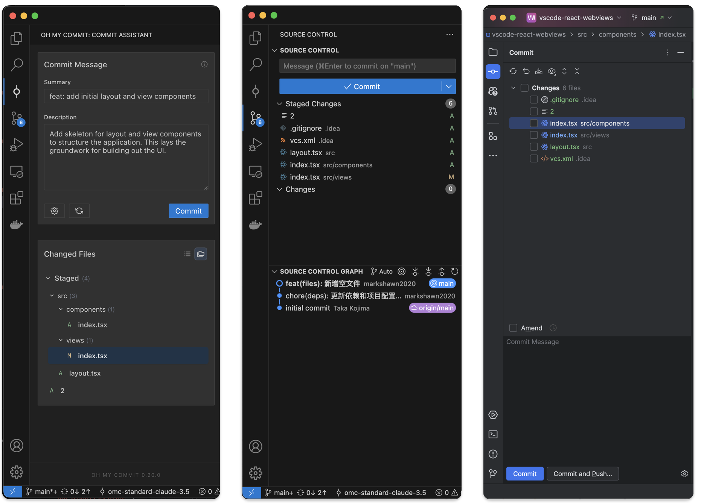

<div align="center">

```shell
                   ____  _       __  __          _____                          _ _   
                  / __ \| |     |  \/  |        / ____|                        (_) |  
                 | |  | | |__   | \  / |_   _  | |     ___  _ __ ___  _ __ ___  _| |_ 
                 | |  | | '_ \  | |\/| | | | | | |    / _ \| '_ ` _ \| '_ ` _ \| | __|
                 | |__| | | | | | |  | | |_| | | |___| (_) | | | | | | | | | | | | |_ 
                  \____/|_| |_| |_|  |_|\__, |  \_____\___/|_| |_| |_|_| |_| |_|_|\__|
                                         __/ |                                        
                                        |___/                                         

```

<h1 align="center">Oh My Commit</h1>

<p align="center">
  ✨Your Next-gen AI-powered Commit Solution ✨
</p>

<p align="center">
  
  
  
</p>


English | [中文](./README.zh-CN.md) | [Website Docs](https://oh-my-commit.github.io) | [VScode Extension](https://marketplace.visualstudio.com/items?itemName=ohmycommit.ohmycommit)

</div>

## Product Comparison

<div align="center">
✅ Full Support &nbsp;&nbsp;|&nbsp;&nbsp; ⚠️ Partial Support &nbsp;&nbsp;|&nbsp;&nbsp; 🚧 In Development &nbsp;&nbsp;|&nbsp;&nbsp; ➖ Not Supported
</div>

&nbsp;

| Features | Oh My Commit | VSCode VCS | JetBrains VCS | Other AI Commit Plugins | AI Commit CLI |
|---------------|---------|------------|--------------|-------------------|---------------|
| **Basic Features** |
| Git Integration | ✅ | ✅ | ✅ | ⚠️ | ➖ |
| Diff Preview | ✅ | ✅ | ✅ | ➖ | ➖ |
| Multi-file Commits | ✅ | ✅ | ✅ | ⚠️ | ⚠️ |
| **AI Features** |
| Smart Message Generation | ✅ | ➖ | ➖ | ✅ | ✅ |
| Multi-language Support | ✅ | ➖ | ➖ | ⚠️ | ⚠️ |
| Custom Algorithm Implementation | ✅ | ➖ | ➖ | ➖ | ➖ |
| **User Experience** |
| CLI Support | ✅ | ➖ | ➖ | ➖ | ✅ |
| GUI Interface | ✅ | ✅ | ✅ | ⚠️ | ➖ |
| Shortcut Support | 🚧 | ✅ | ✅ | ⚠️ | ➖ |
| **Advanced Features** |
| Team Standards Config | 🚧 | ➖ | ⚠️ | ➖ | ➖ |
| Changesets Integration | 🚧 | ➖ | ➖️ | ➖ | ➖ |
| Commit Templates | 🚧 | ⚠️ | ✅ | ➖ | ➖ |
| Commit History Analysis | 🚧 | ✅ | ✅ | ➖ | ➖ |
| **Extensibility** |
| Plugin Architecture | ✅ | ✅ | ✅ | ➖ | ➖ |
| Custom Workflows | 🚧 | ⚠️ | ✅ | ➖ | ➖ |

## UI Comparison



## System Architecture

Oh My Commit is a modular intelligent commit solution:

- **Multi-platform Support**
  - CLI Tool: Standalone command-line program for use in any terminal
  - VSCode Extension: Graphical interface with silent and interactive modes
  - Future Plans: Support for more IDEs and platforms

- **Core Components**
  - Shared Configuration: Cross-platform unified user settings and team standards
  - Algorithm Marketplace: Customizable AI commit algorithms with extensible provider system
  - Data Analytics: Commit history analysis and team collaboration insights (planned)

- **Technical Features**
  - Monorepo Architecture: Multi-package management with pnpm
  - Module Decoupling: Separation of core logic, UI, and algorithm providers
  - Plugin Design: Support for third-party extensions and customization

## AI Capabilities

- **Multi-model Support**

  - Built-in Oh My Commit professional model optimized for code commits
  - Support for OpenAI GPT-3.5/4, Claude, and other mainstream models
  - Customizable AI service endpoints for flexible expansion

- **Provider Installation**

  - Install official provider via npm:
    ```bash
    # Install globally
    npm install -g @oh-my-commit/provider-official
    
    # Or install locally in your project
    npm install @oh-my-commit/provider-official
    ```
  - Provider files will be automatically installed to `~/.oh-my-commit/providers/official/`
  - Custom providers can be installed to the same directory structure

- **Intelligent Analysis**

  - Deep understanding of code change context
  - Automatic identification of refactoring, bugfix, feature types
  - Generate commit messages matching team style

- **Continuous Optimization**
  - Continuous improvement based on user feedback
  - Regular model capability updates
  - Support for custom training fine-tuning

## Usage

> ⚠️ **Pre-usage Configuration**
> 
> Taking the official algorithm `@oh-my-commit/provider-official` as an example, you need to:
> 1. Configure AI service key: `ANTHROPIC_API_KEY` or VSCode setting `oh-my-commit.ai.apiKeys.anthropic`
> 2. (Optional) Configure proxy:
>    - CLI: `HTTP_PROXY` environment variable
>    - VSCode: `ohMyCommit.proxy.url` and `ohMyCommit.proxy.enabled`

> CLI and VSCode can be used independently with shared synchronized configuration

### CLI Usage

```bash
# Install CLI tool globally
npm install -g oh-my-commit

# Install official AI Commit algorithm implementation
# Third-party directory: `~/.oh-my-commit/providers/`
npm install -g @oh-my-commit/provider-official

# Use in git repository
omc  # View help
omc gen # AI generate commit
```

### VSCode Extension

1. Install "[**Oh My Commit**](https://marketplace.visualstudio.com/items?itemName=oh-my-commit.oh-my-commit)" from VSCode marketplace
2. Usage methods:
   - Shortcut: `cmd+shift+p` search for "OMC: Quick Commit"
   - Status Bar: Click the Commit icon in status bar
   - Source Control: Use VSCode's built-in Git panel

## Configuration

| Setting                                | Type    | Default                      | Description                                   | Options                                                                                                    |
| -------------------------------------- | ------- | ---------------------------- | --------------------------------------------- | ---------------------------------------------------------------------------------------------------------- |
| `oh-my-commit.model.id`                | string  | "omc-standard-claude-3.5"    | Select AC service provider and model          | • `omc-standard-claude-3.5`<br>• (Custom implementations via local install / source PR / npm publish)        |
| `oh-my-commit.git.lang`                | string  | "system"                     | Git commit message language                    | • `system`: Follow system language<br>• `zh_CN`: Chinese commit messages<br>• `en_US`: English commit messages |
| `oh-my-commit.ai.apiKeys`              | object  | -                           | AI service provider API key configuration      |                                                                                                            |
| `oh-my-commit.ui.mode`                 | string  | "panel"                      | Commit interface mode                          | • `notification`: Generate commit messages via notifications, ideal for quick personal development<br>• `panel`: Resident panel with professional view supporting title/content editing and diff viewing, suitable for professional collaboration |
| `ohMyCommit.proxy.enabled`             | boolean | false                       | Enable proxy for API requests                  | `true / false`                                                                                              |
| `ohMyCommit.proxy.url`                 | string  | "http://localhost:7890"     | Proxy server URL                              | Any valid proxy URL (e.g. "http://localhost:7890")                                                          |

Note: Our omc-standard-claude-3.5 requires users to configure their own ANTHROPIC_API_KEY and proxy (if necessary), which can be set in user settings.

## Contributing

Contributions are welcome! Please check our [Contributing Guide](CONTRIBUTING.md) for details.

## Support

If you encounter any issues or have suggestions:

1. Check the [FAQ](docs/guide/faq.md)
2. Submit an [Issue](https://github.com/oh-my-commit/oh-my-commit/issues)

## License

Oh My Commit is licensed under [MIT + Commons Clause](./LICENSE). This means:

- ✅ You can freely use, modify, and distribute this software
- ✅ You can use this software in personal or internal projects
- ✅ You can create and distribute modified versions
- ❌ You cannot sell this software as a paid service or product
- ❌ You cannot commercialize this software without authorization

If you want to use Oh My Commit in a commercial environment, please contact us for a commercial license.

For detailed terms, please check the [LICENSE](./LICENSE) file.
