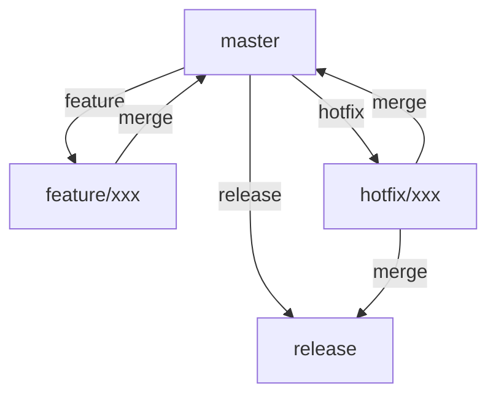

# 团队协作

::: warning 即将推出
团队协作功能目前正在开发中，预计将在 2024 年 Q2 推出。您可以在[即将推出](/guide/coming-soon)页面了解更多信息。
:::

YAAC 计划提供强大的团队协作功能，帮助团队统一提交风格，提高协作效率。以下是即将推出的功能预览。

## 团队配置

### 配置文件

在项目根目录创建 `.yaac/config.json`：

```json
{
  "version": "1.0.0",
  "team": {
    "name": "Your Team",
    "language": "zh-CN",
    "commitStyle": "conventional"
  },
  "rules": {
    "scopes": ["core", "ui", "api", "docs"],
    "types": ["feat", "fix", "docs", "style", "refactor", "test", "chore"],
    "subjectLength": 72,
    "bodyLength": 100
  },
  "templates": {
    "feat": "feat(${scope}): ${subject}\n\n${body}",
    "fix": "fix(${scope}): ${subject}\n\nFixes #${issue}"
  }
}
```

### Git Hooks

在 `.yaac/hooks` 目录下配置 Git Hooks：

```bash
#!/bin/bash
# .yaac/hooks/pre-commit

# 运行 YAAC 提交检查
yaac check --strict

# 如果检查失败，阻止提交
if [ $? -ne 0 ]; then
  echo "提交不符合团队规范，请修改后重试"
  exit 1
fi
```

## 工作流集成

### 1. GitHub 工作流

```yaml
# .github/workflows/yaac.yml
name: YAAC Commit Check

on: [pull_request]

jobs:
  check:
    runs-on: ubuntu-latest
    steps:
      - uses: actions/checkout@v2
      - name: YAAC Check
        uses: yaac/github-action@v1
        with:
          config: .yaac/config.json
```

### 2. GitLab CI/CD

```yaml
# .gitlab-ci.yml
yaac:
  stage: test
  script:
    - npm install -g yaac-cli
    - yaac check --config .yaac/config.json
  only:
    - merge_requests
```

### 3. Azure DevOps

```yaml
# azure-pipelines.yml
steps:
- task: NodeTool@0
  inputs:
    versionSpec: '16.x'
- script: |
    npm install -g yaac-cli
    yaac check --config .yaac/config.json
  displayName: 'YAAC Check'
```

## 团队最佳实践

### 1. 提交规范

- **类型前缀**
  ```
  feat: 新功能
  fix: 修复
  docs: 文档
  style: 样式
  refactor: 重构
  test: 测试
  chore: 杂项
  ```

- **作用域**
  ```
  feat(ui): 添加新按钮组件
  fix(api): 修复用户认证问题
  docs(readme): 更新安装说明
  ```

- **提交信息模板**
  ```
  <类型>(<作用域>): <简短描述>

  <详细描述>

  <关闭的问题>
  ```

### 2. 代码审查流程

1. **提交前检查**
   - 运行自动化测试
   - 执行代码格式化
   - 验证提交信息

2. **审查要点**
   - 代码质量
   - 提交信息规范
   - 变更影响范围

3. **自动化集成**
   - CI/CD 流水线检查
   - 自动化代码审查
   - 提交信息验证

### 3. 分支策略



## 工具集成

### 1. VS Code 设置

```json
{
  "settings": {
    "yaac.team.configPath": ".yaac/config.json",
    "yaac.team.enforceConfig": true,
    "yaac.team.autoFormat": true
  }
}
```

### 2. IDE 插件

- **JetBrains IDE**
  ```json
  {
    "yaac.plugin": {
      "enabled": true,
      "configPath": ".yaac/config.json",
      "autoSync": true
    }
  }
  ```

- **Sublime Text**
  ```json
  {
    "yaac_config": ".yaac/config.json",
    "yaac_auto_format": true
  }
  ```

### 3. CLI 工具

```bash
# 全局安装
npm install -g yaac-cli

# 检查提交信息
yaac check "feat(ui): add button"

# 应用团队规范
yaac apply --config .yaac/config.json
```

## 常见问题解决

### 1. 配置冲突

问题：团队配置与个人配置冲突
解决：
```json
{
  "yaac.team.allowOverride": [
    "ui.theme",
    "ui.language"
  ]
}
```

### 2. 提交被拒绝

问题：提交不符合团队规范
检查：
```bash
yaac check --verbose
yaac fix --auto
```

### 3. 同步问题

问题：配置未同步到团队成员
解决：
```bash
yaac sync --team
git pull --rebase
```
